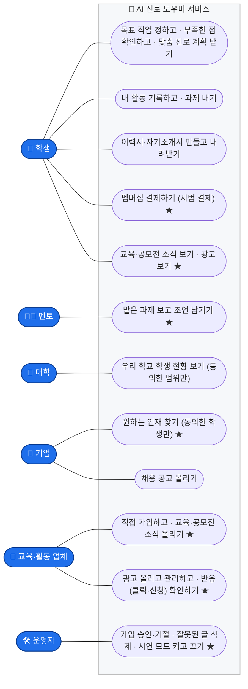
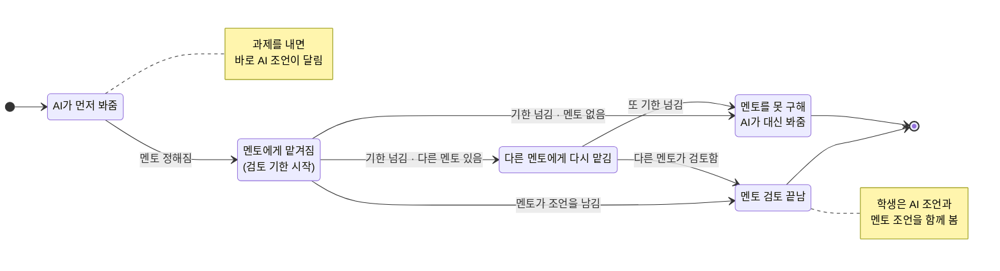
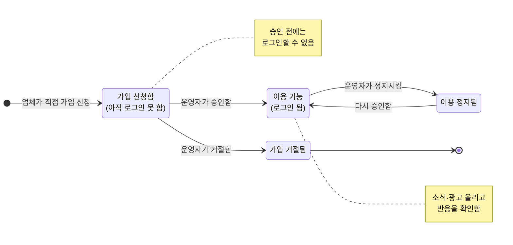
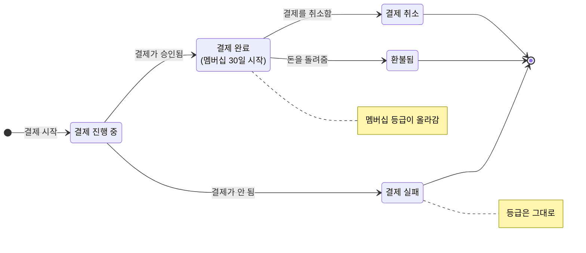
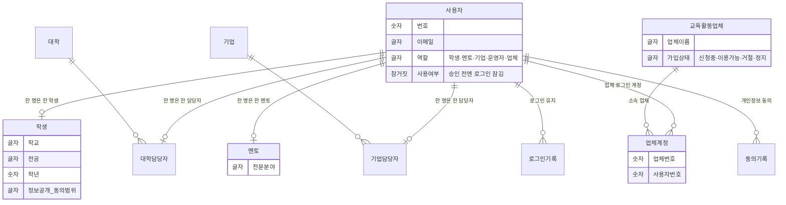
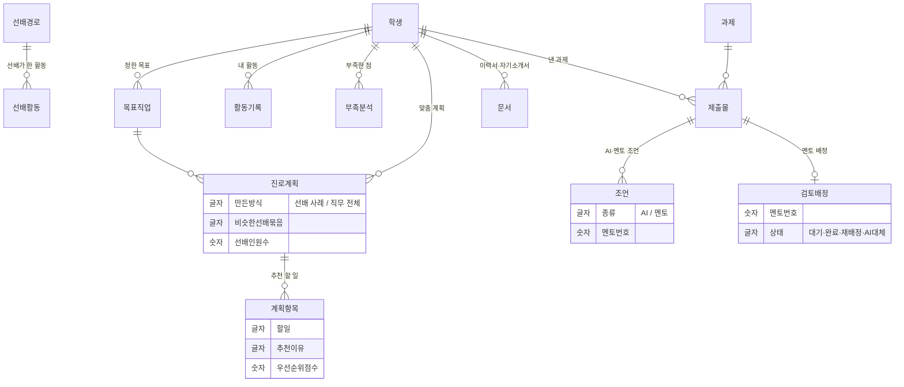
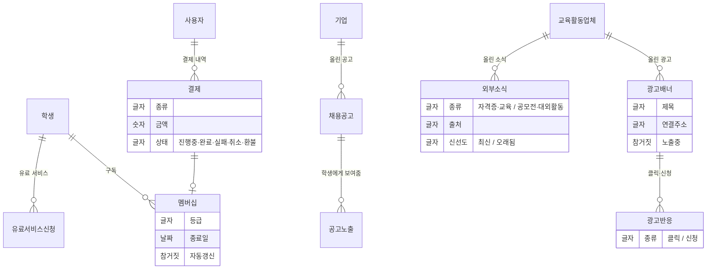

# 발표용 다이어그램 — AI 진로 도우미 서비스 (쉬운 말 버전)

> 발표 청중이 바로 이해하도록 **전문 용어 대신 일상어**로 작성했습니다.
> - **유스케이스** — 누가(사용자) 무엇을(기능) 하는지 **관계**
> - **상태 그림** — 일이 **어떤 단계를 거쳐 어떻게 바뀌는지(상태 변화)**
> - **데이터 그림(ERD)** — 어떤 **정보들이 서로 어떻게 연결되는지**
>
> Mermaid 코드라 GitHub·Notion·슬라이드에서 바로 보입니다.
> 그림 파일: `docs/diagrams/svg/`, `docs/diagrams/png/` · 묶음 PDF `docs/diagrams/발표자료-AI진로로드맵.pdf`

---

## 1. 누가 무엇을 하나 (유스케이스)

여섯 종류의 사용자가 서비스 안에서 어떤 일을 하는지 보여줍니다. ★ = 새로 추가된 기능.

---

## 2. 낸 과제가 거치는 단계 (상태 그림)

학생이 과제를 내면, 멘토를 못 구해도 AI가 대신 봐주어 **누구나 조언을 받게** 됩니다.

---

## 3. 업체가 가입하고 이용하기까지 (상태 그림)

업체가 직접 가입해도, **운영자가 승인하기 전에는 로그인할 수 없습니다.**

---

## 4. 멤버십 결제 처리 (상태 그림)

결제가 끝나면 멤버십 등급이 올라가고, 실패하면 등급은 그대로입니다.

---

## 5. 정보 연결도 — 회원·계정

## 6. 정보 연결도 — 진로 성장

## 7. 정보 연결도 — 결제·광고·제휴

---

## 부록 — 발표 한 줄 요약

| 그림 | 한마디로 |
|------|----------|
| **누가 무엇을** | 학생·멘토·대학·기업·업체·운영자가 각자 할 일이 다 동작합니다 |
| **과제 단계** | 멘토를 못 구해도 AI가 대신 봐줘서 누구나 조언을 받습니다 |
| **업체 가입** | 직접 가입해도 운영자 승인 전엔 로그인 못 합니다 (안전장치) |
| **결제 처리** | 되돌릴 수 없는 단계(실패·환불)까지 분명하게 나눴습니다 |
| **정보 연결** | 회원 정보는 동의한 범위 안에서만 보이도록 연결했습니다 |
