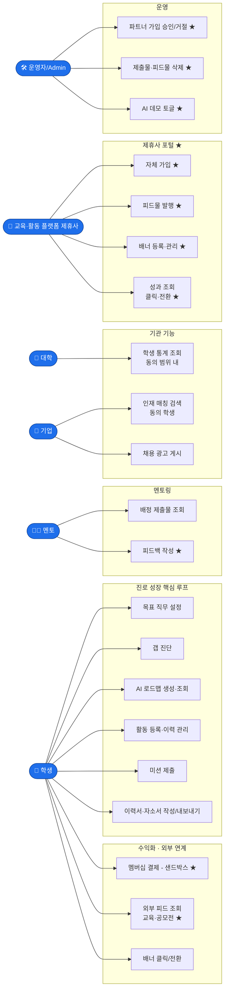
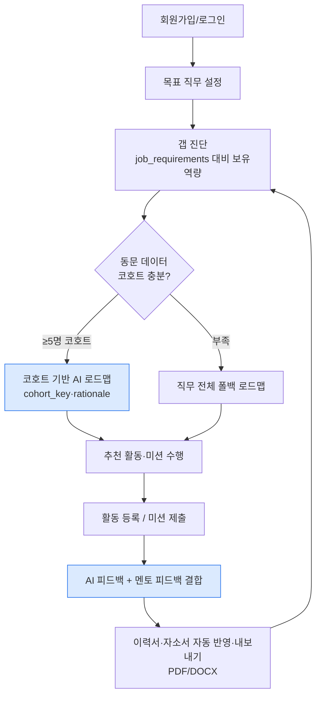
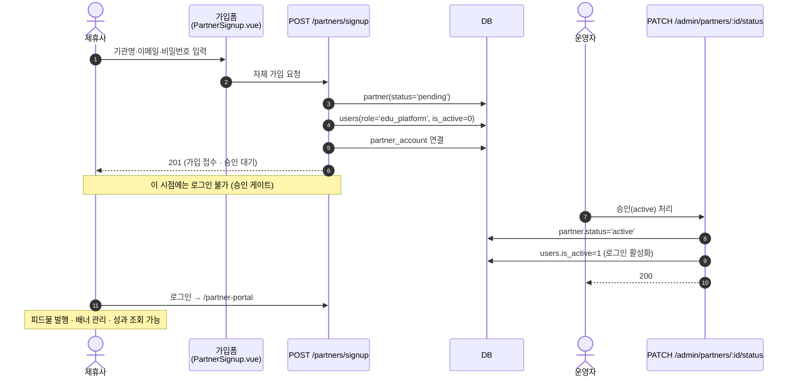
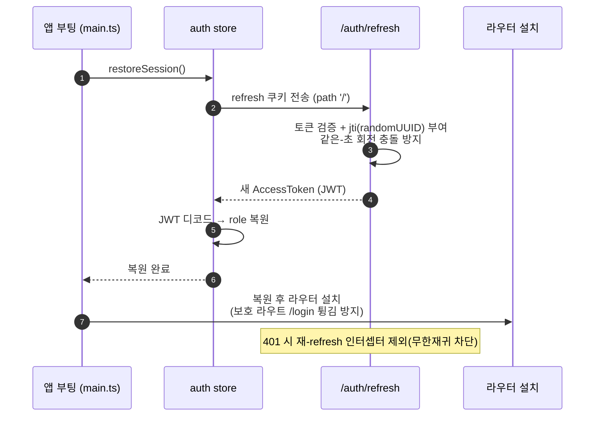
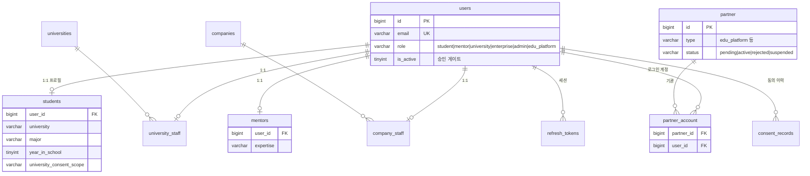
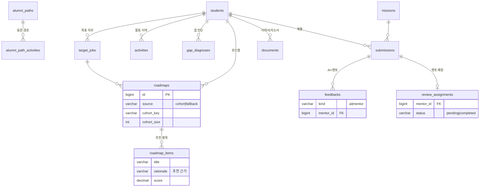
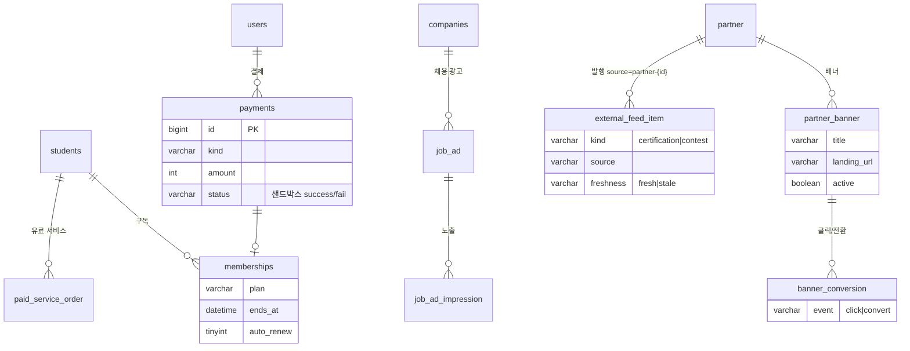

# 발표용 다이어그램 — AI 진로 로드맵 플랫폼 (003 · 004 · 005)

> 작업물 전체를 발표용으로 정리한 다이어그램 모음입니다.
> Mermaid 코드블록이라 GitHub · Notion · VS Code(Markdown Preview Mermaid) · 슬라이드 변환기에서 바로 렌더됩니다.
> 가독성을 위해 ERD는 도메인별로 3개로 분리했습니다(전체 ~40개 테이블 중 핵심만).

---

## 1. 유스케이스 다이어그램 (역할별 기능 범위)

6개 역할(actor)이 무엇을 할 수 있는지 한눈에 보여줍니다. ★ = 005에서 추가/실동작화된 기능.

---

## 2. 프로세스 다이어그램

### 2-1. 학생 핵심 성장 루프 (003/004 핵심 가치)

### 2-2. 제휴사 자체가입 + 운영자 승인 게이트 (005 신규)

### 2-3. 세션 복원 + Refresh 토큰 회전 (005 보안, E2E로 버그 4건 수정)

---

## 3. 데이터 모델 (ERD) — 도메인별 3분할

### 3-1. 인증 · 계정 · 동의

### 3-2. 커리어 성장 (진단 · 로드맵 · 미션 · 문서)

### 3-3. 수익화 · 제휴 · 광고 (004/005)

---

## 부록 — 발표 시 강조 포인트

| 영역 | 핵심 메시지 |
|------|-------------|
| **역할별 실동작 (005)** | 6개 역할 모두 로그인→고유 기능 동작. 멘토 피드백·제휴사 포털 신규 |
| **AI 로드맵 신뢰성** | 동문 코호트(≥5명) 기반 + 근거(rationale), 부족 시 직무 전체 폴백 |
| **승인 게이트** | 제휴사 자체가입은 `pending`+`is_active=0` → 운영자 승인 전 로그인 차단 |
| **세션 보안** | E2E로 브라우저에서만 드러난 refresh 토큰 버그 4건 발견·수정 |
| **데이터 거버넌스** | 동의 범위(consent_scope)별 대학/기업 노출 제어 |
