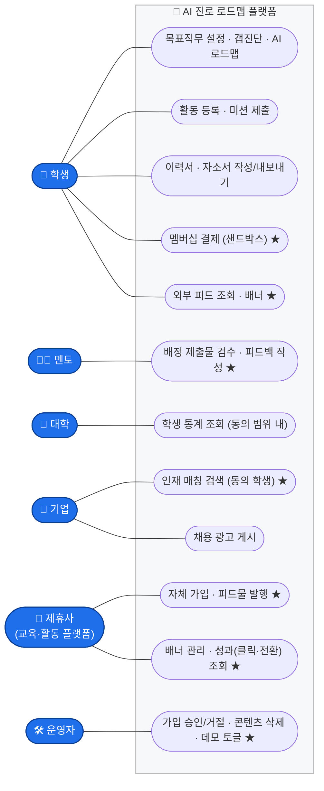
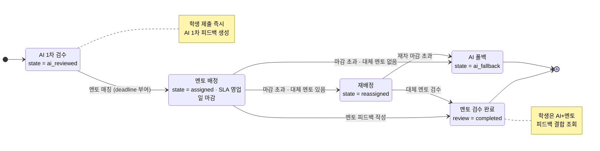
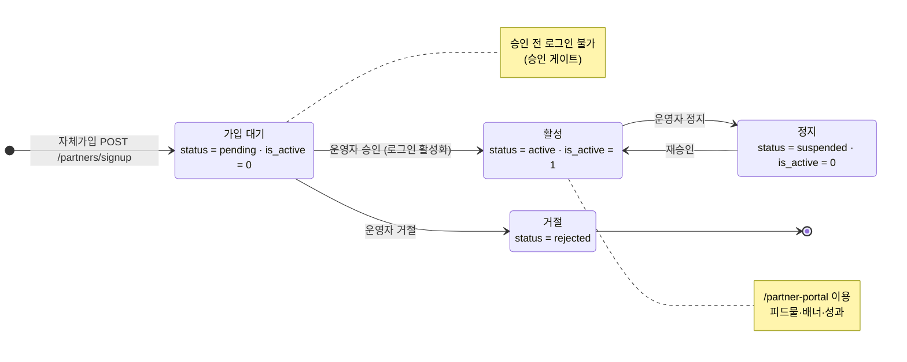
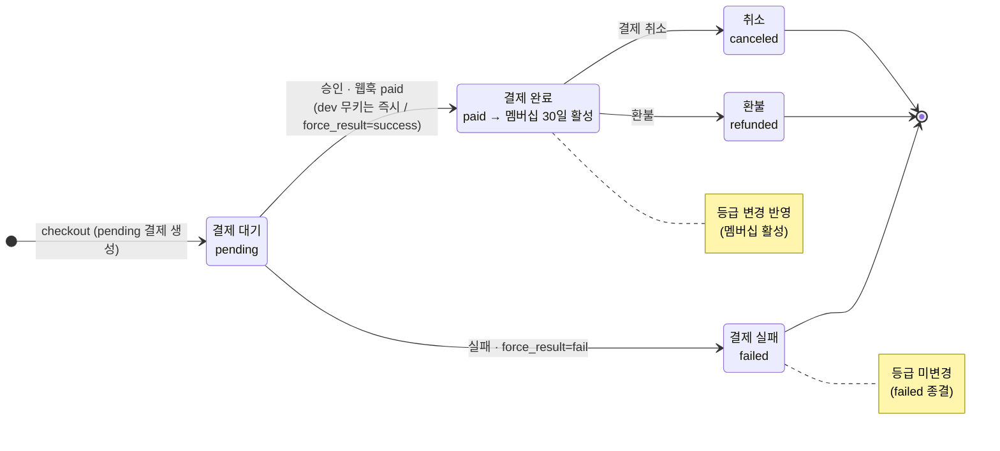
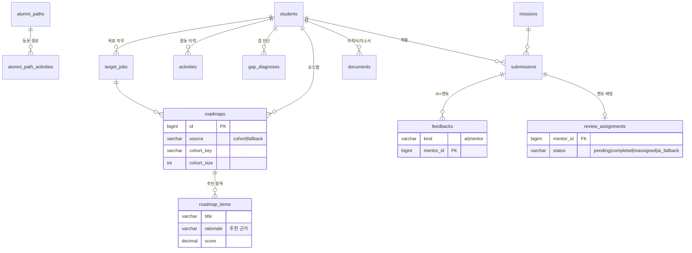
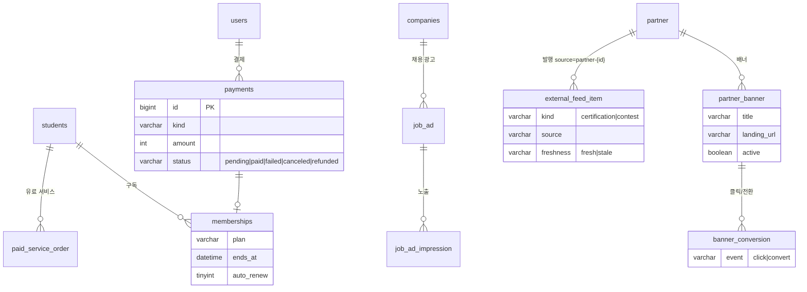

# 발표용 다이어그램 — AI 진로 로드맵 플랫폼 (003 · 004 · 005)

> 각 다이어그램은 **무엇이 핵심인 시스템 표현인지**에 맞춰 작성했습니다.
> - **유스케이스** — 사용자(actor) ↔ 기능(use case) **관계**가 핵심
> - **프로세스(상태 전이)** — 업무 흐름 속 **상태 전이(state transition)**가 핵심
> - **데이터 모델(ERD)** — **데이터 구조**가 핵심
>
> Mermaid 코드블록이라 GitHub · Notion · VS Code · 슬라이드 변환기에서 바로 렌더됩니다.
> 추출본: `docs/diagrams/svg/`, `docs/diagrams/png/`, 묶음 PDF `docs/diagrams/발표자료-AI진로로드맵.pdf`

---

## 1. 유스케이스 다이어그램 — 사용자-기능 관계

6개 actor가 시스템 경계 안의 어떤 기능과 연결되는지(이용 관계)를 보여줍니다. ★ = 005 신규.

---

## 2. 프로세스(상태 전이) — 미션 제출물 · 멘토 검수

`submissions.state` + `review_assignments.status`의 실제 전이. SLA(영업일) 초과 시 재배정/AI 폴백으로 분기.

---

## 3. 프로세스(상태 전이) — 제휴사 가입 승인 게이트

`partner.status` + 로그인 게이트 `users.is_active`. 승인 전에는 로그인 불가(005 신규).

---

## 4. 프로세스(상태 전이) — 결제 · 멤버십

`payments.status` 상태머신(`canTransition` 맵 그대로). `paid` 시 멤버십 30일 활성·등급 변경.

---

## 5. 데이터 모델(ERD) — 인증 · 계정 · 동의

## 6. 데이터 모델(ERD) — 커리어 성장

## 7. 데이터 모델(ERD) — 수익화 · 제휴 · 광고

---

## 부록 — 발표 시 강조 포인트

| 영역 | 핵심 메시지 |
|------|-------------|
| **유스케이스** | 6개 역할 모두 로그인→고유 기능 동작. 멘토 검수·제휴사 포털이 005 신규 |
| **상태 전이(검수)** | SLA 미준수 시 자동 재배정 → 그래도 안 되면 AI 폴백으로 학생 경험 보장 |
| **상태 전이(가입)** | 자체가입은 pending+is_active=0 → 운영자 승인 게이트 |
| **상태 전이(결제)** | 실제 `canTransition` 상태머신, 비가역 전이(failed/refunded 종결) |
| **ERD** | users 1:1 프로필 분리, 동의 범위(consent_scope) 기반 노출 거버넌스 |
